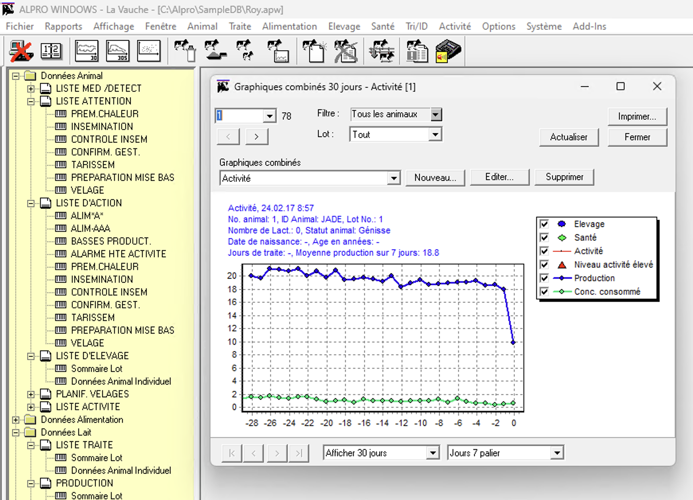
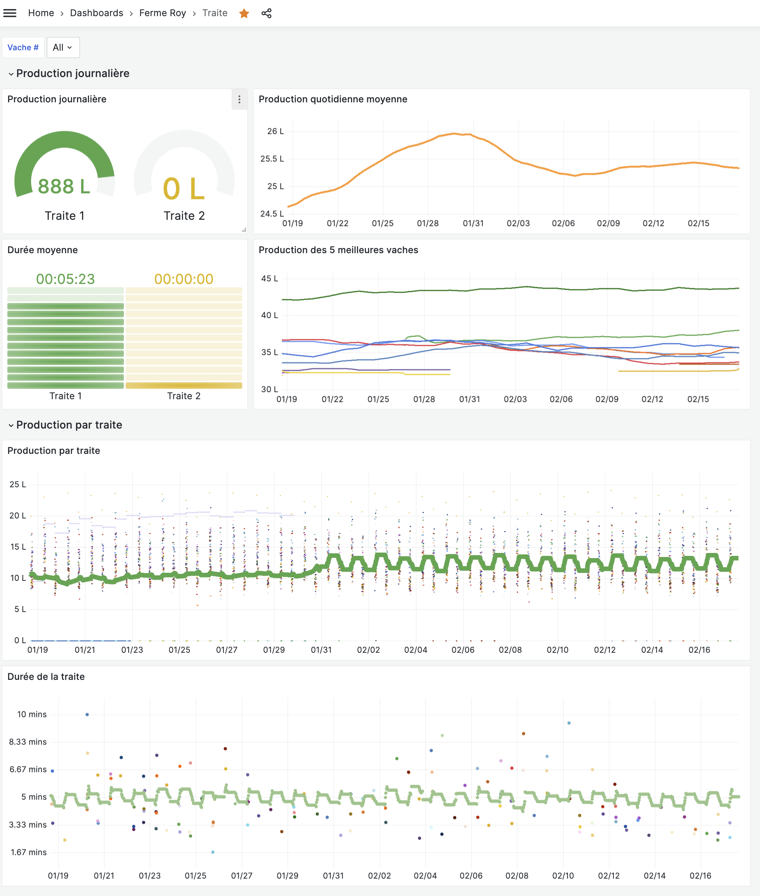

# Alpro OpenMetrics exporter

This repository contains example Python3 code permitting to collect key
measurements from a DeLaval ALPRO™ database, and to push those measurements to
VictoriaMetrics.

## DeLaval ALPRO™

DeLaval ALPRO™ is an old piece of Windows XP software, which provides lots of
information regarding cows (fertility rate, milk flow, milk yield, feed
quantity, etc.)

The software is good, but only usable on the PC it is installed on, and the GUI
is a little bit outdated. See for yourself:



Luckily, it uses an AcessDB database, also known as MDB database, which we can
fairly simply convert to an SQLite DB.

### Backing up the Alpro database

Getting the data out of the PC can be done as follows:

1. create a free S3 bucket with Cloudflare R2's free tier
1. setup a backup script on the PC, using restic and pushing the data to S3.
1. don't forget to set up backup rotation ;)

```bat
@echo off
setlocal
echo "Sauvegarde de la base de donnees Alpro"

rem Set the path to the Restic executable
set RESTIC_PATH="C:\alpro\restic_backup\restic.exe"

rem Set your Restic repository URL (e.g., S3 endpoint)
set RESTIC_REPOSITORY=s3:abcd.r2.cloudflarestorage.com/abcd-salle-de-traite

rem Set your AWS Access Key ID and Secret Access Key
set AWS_ACCESS_KEY_ID=access_key
set AWS_SECRET_ACCESS_KEY=secret_key
set RESTIC_PASSWORD_FILE=C:\alpro\restic_backup\repo_password.txt
rem Set the directory you want to back up
set BACKUP_DIR=C:\alpro\SampleDB\

rem Set a unique snapshot ID (you can use a timestamp)
set SNAPSHOT_ID=%DATE:/=-%_%TIME::=-%

rem Execute Restic to create a backup
%RESTIC_PATH% backup %BACKUP_DIR% --tag %SNAPSHOT_ID%
%RESTIC_PATH% unlock
%RESTIC_PATH% forget --keep-daily 7 --keep-monthly 24
%RESTIC_PATH% prune
endlocal
```

## Converting the Database to SQLite

Now that our access database has been exported, you have several option to start peeking at it:

On a Mac computer, you can use [MDB Viewer](https://eggerapps.at/mdbviewer/)
for example. On Windows you could maybe use Microsoft Access or another
software.
The important bit is that you can convert this MDB database to an SQLite
Database, which we'll be able to work with quite simply later on.

We use [mdbtools](https://github.com/mdbtools/mdbtools) to convert the
database, and we actually run mdbtools with a little python script:
[`access_dump.py`](./access_dump.py).

The conversion happens as follows:

```shell
#!/bin/bash

rm alpro.{db,sql} # cleanup old converted db

python3 ./access_dump.py ./sample-db.apw >> alpro.sql
python3 ./access_dump.py ./sample-db.aph >> alpro.sql
sqlite3 alpro.db < alpro.sql
```

## Working with the Database

Now that we have our data available in a (more) modern database, it's time to start exploring it!

If you search a little, you'll find the the milking data is mainly located in
the `TblCowLast30DayMilk` table (for the previous 30 days of milking data,
excluding the current day), and in the `TblCow` table, only for the current day.

For that reason, exporting the data will be a little more complicated than
initially assumed, as we will need to either process the historical data, or
the daily data. This can be chosen with a `--history` or `--daily` flag.

As you'll be able to see in the
[`./alpro-to-openmetrics.py`](./alpro-to-openmetrics.py) Python3 script, we
make extensive use of [pandas](https://pandas.pydata.org/) to work with the
tables, as it provides a large number of data manipulation libraries, is really
well documented, and fun to work with.

## Converting to OpenMetrics (Prometheus/VictoriaMetrics/..)

Now that we can work with our data with pandas, the last step is to parse the
timestamps, the durations, add some columns which we will use as labels in the
exported format

One tricky was also to compute the daily total milk yield (as we theoretically
have up to 4 milking sessions per day). After some effort, I managed to compute
it with the following commands:

```python3
sum = df.groupby(["day","CowNo"])["Yield"].sum()
df = cow_milk_30d.merge(sum,how='left',on=["CowNo","day"],suffixes=('', f'_Daily'))
```

Now that we have prepared a database with the proper columns, timestamps,
values, the last step is to convert each measurement in an OpenMetrics record.

This is done with a `convert_to_openmetrics` function, which converts a `row`
to an openmetrics record. N.B., the `row` needs to have at least a `value` and
`timestamp` column. All other columns are then converted to labels.

```python3
def convert_to_openmetrics(row: pd.Series, metric_name: str):
    ts: pd.Timestamp = row["timestamp"]
    ts = int(ts.timestamp()) * 1000
    value = row["value"]
    labels = ""
    for label in row.axes[0]:
        if label != "timestamp" and label != "value":
            labels += f'{label}="{row[label]}",'
    return f"{metric_name}{{{labels}}} {float(value)} {ts}"

```

We call this function with a `df.apply(..)` call, which is much faster than iterating with a for loop:

```python3
cols = ["cow_id", "cow_no", "timestamp", "session"]
df = cow_milk_30d[cols + ["Yield"]] # we filter the columns we are interested in (timestamp, labels) and include the current measurement column ("Yield")
metrics = pd.concat(
    [
        metrics,
        df.rename(columns={"Yield": "value"}).apply(
            lambda row: convert_to_openmetrics(row, metric_name), axis=1
        ),
    ]
)
```

The produced metrics look as follows:

```text
11                             cow_milk_yield{cow_id="JADE",cow_no="1",session="1",} 9.32 1705383960000
12                            cow_milk_yield{cow_id="JADE",cow_no="1",session="2",} 11.07 1705422540000
13                         cow_milk_yield{cow_id="JURAFLO",cow_no="2",session="1",} 16.63 1705384860000
14                         cow_milk_yield{cow_id="JURAFLO",cow_no="2",session="2",} 12.82 1705421520000
15                        cow_milk_yield{cow_id="JOLIMOME",cow_no="3",session="1",} 12.34 1705380300000
                                                     ...
4049                 cow_milk_daily_yield{cow_id="JETSET",cow_no="72",session="2",} 20.58 1708014720000
4051                 cow_milk_daily_yield{cow_id="FIGGIE",cow_no="75",session="2",} 20.87 1708015740000
4053                  cow_milk_daily_yield{cow_id="ETIVA",cow_no="77",session="2",} 24.34 1708014180000
4055    cow_milk_daily_yield{cow_id="JESSIE",cow_no="78",session="2",} 22.729999999999997 1708016460000
4057               cow_milk_daily_yield{cow_id="HESQUISE",cow_no="80",session="2",} 33.47 1708011780000
Name: 0, Length: 20290, dtype: object
```

## Pushing the records to your Time Series Database

The final step, now that our `metrics` DataFrame conatains a long list of
OpenMetrics records, will be to push those to your Time Series Database (TSDB)
of choice.

In my case it's VictoriaMetrics, an OpenSource TSDB written in Go. It is very
efficient, fully capable of storing data for multiple years, is built with a
simple architecture, and extremely well documented.
The [documentation for pushing
metrics](https://docs.victoriametrics.com/single-server-victoriametrics/#how-to-import-data-in-prometheus-exposition-format)
is a helpful example in this case, and in the end, all that's need to import
the data is to make the following `POST` request:

```python3
if len(metrics) > 0:
    print(metrics[0])
    url = "http://vmagent-vmagent:8429/insert/2900/prometheus/api/v1/import/prometheus"
    requests.post(
        f"{url}/?extra_label=retention_period=long-term&extra_label=job=milk_data_v1.0.1",
        data=metrics[0].str.cat(sep="\n"),
    )
```

As you can see, I add two extra labels: one that I use to state that the data
should be stored in my 10 years retention period VictoriaMetrics cluster
([configured here for the curious
reader](https://github.com/clementnuss/k8s-gitops/blob/0b95c0acfb115a1f797061aa61dfa3db68e60e2d/workloads/metrics/vmagent.yaml#L27-L35)),
and the other label is used for cases where I have a breaking change in the
exported metrics format. When that happens, I can delete the old or corrupted data with a call to `vmselect` endpoint:

```shell
curl -v vmselect-vmselect:8481/delete/2900/prometheus/api/v1/admin/tsdb/delete_series -d 'match[]={job="milk_data_v1.0.1"}'
```

## Processing multiple months at once

It sometimes happen that I break the format of the metrics, or that I need to reimport the data to the TSDB for the last few months.
I use the [`import_all_snapshots.sh`](./import_all_snapshots.sh) shell script to do that:

```shell
#!/bin/env bash

SNAPSHOTS=$(restic snapshots | tail -n +3 | head -n -3 | awk '{print $1}')

for snapshot in $SNAPSHOTS; do
    echo restoring snapshot id: "$snapshot"
    restic restore --target ./restore "$snapshot"
    find ./restore -type f -exec mv {} ./ \;
    bash convert.sh
    ls -lsah alpro.db
    python3 alpro-to-openmetrics.py --history
done
```

## Visualizing the data in Grafana

Finally, we can visualize our production data with Grafana, and the dashboard
looks as follows:



